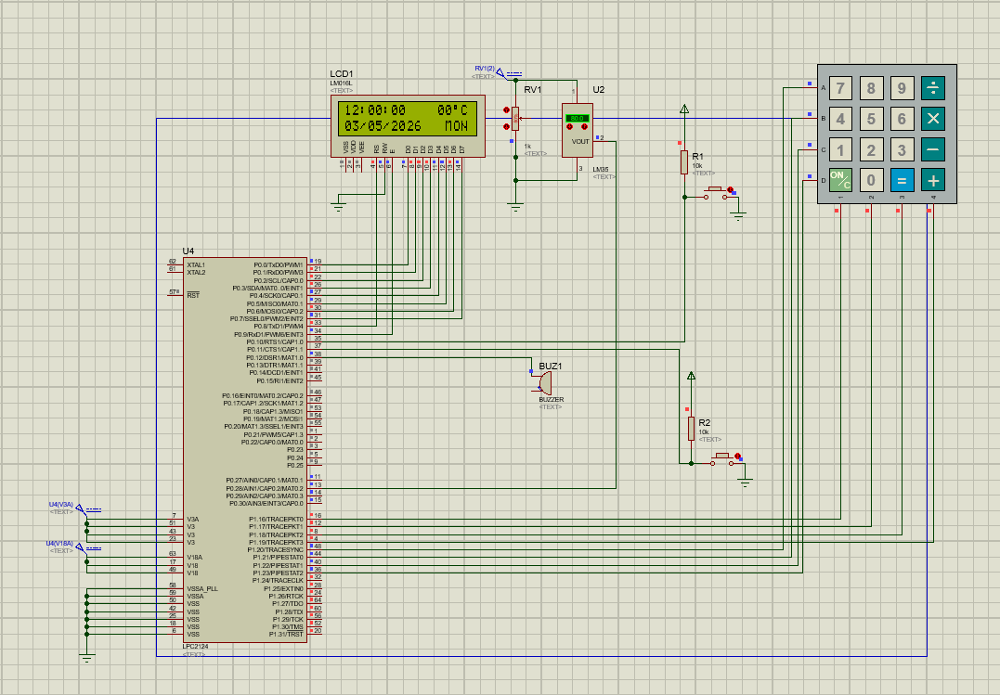
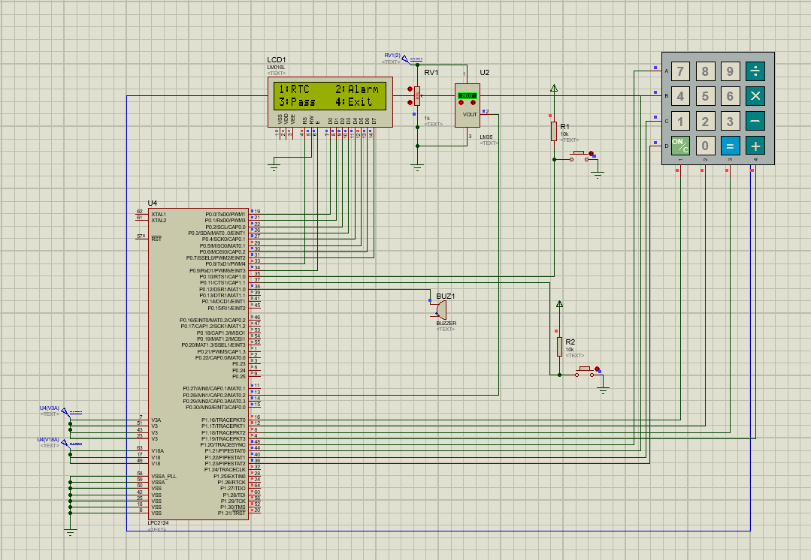

# EnviroTime — Embedded Real-Time Clock & Environment Monitor

> A Embedded systems project built on the **NXP LPC2148 ARM7TDMI-S** microcontroller, implementing a real-time clock display, multi-alarm management, ambient temperature monitoring, and a password-protected configuration menu — all driven without an operating system.

---

## Table of Contents

- [Project Overview](#project-overview)
- [Key Features](#key-features)
- [System Architecture](#system-architecture)
- [Images](#images)
- [Hardware Components](#hardware-components)
- [Circuit Connections](#circuit-connections)
- [Software Architecture](#software-architecture)
- [Module Breakdown](#module-breakdown)
- [Menu Navigation Flow](#menu-navigation-flow)
- [LCD Display Format](#lcd-display-format)
- [Technical Specifications](#technical-specifications)
- [Build & Flash Instructions](#build--flash-instructions)
- [Project Outcomes](#project-outcomes)
- [Skills Demonstrated](#skills-demonstrated)
- [File Structure](#file-structure)
- [Author](#author)

---

## Project Overview

**EnviroTime** is a standalone embedded system that functions as a real-time clock, multi-alarm controller, and environment sensor — all displayed on a 16×2 character LCD.

The system runs on the LPC2148, a 32-bit ARM7TDMI-S microcontroller, with **zero external OS, RTOS, or middleware**. Every peripheral — the RTC, ADC, GPIO, keypad scanner, and LCD driver — is configured and driven directly through hardware registers.

The project was developed as a complete hardware-software integration exercise, covering digital circuit design, register-level embedded C programming, timing analysis, and real-world hardware debugging on physical silicon.

---

## Key Features

| Feature | Details |
|---|---|
| **Real-Time Clock** | Displays HH:MM:SS updated every second from the LPC2148 built-in RTC |
| **Date Display** | Shows DD/MM/YYYY and day name (MON, TUE …) on LCD line 2 |
| **Temperature Monitor** | Reads ambient temperature via LM35 sensor and 10-bit ADC, displayed as XX°C |
| **Multi-Alarm System** | Up to 5 independent alarms — each with Add, Edit (time + ON/OFF toggle), Delete, and View |
| **Alarm Buzzer** | Buzzer rings when alarm time matches RTC; stopped by dedicated hardware switch |
| **Password Protection** | 4-digit PIN guards RTC edit and alarm management menus; 3 wrong attempts = 30-second lockout |
| **Password Change** | User can update PIN with current-verify → new → confirm flow |
| **4×4 Matrix Keypad** | Full debounced scanning with backspace (*) and confirm (#) keys |
| **16×2 LCD Driver** | Custom HD44780 8-bit parallel driver written from scratch |
| **PLL Clock Setup** | Configures PLL0 for 60 MHz CPU clock from 12 MHz crystal at boot |
| **Non-blocking Display** | LCD only redrawn when RTC second changes — prevents display flicker |

---

## System Architecture

```
┌─────────────────────────────────────────────────────┐
│                   LPC2148 (ARM7TDMI-S)              │
│                                                     │
│  ┌──────────┐  ┌──────────┐  ┌──────────────────┐   │
│  │  Built-in│  │  10-bit  │  │   GPIO Port 0    │   │
│  │   RTC    │  │   ADC    │  │  P0.0–P0.9 (LCD) │   │
│  │(32.768kHz│  │ (AD0.1)  │  │  P0.10 (SW Edit) │   │
│  │ crystal) │  │ P0.28    │  │  P0.11 (SW Alarm)│   │
│  └────┬─────┘  └────┬─────┘  │  P0.12 (Buzzer)  │   │
│       │              │       └──────────────────┘   │
│       │              │        ┌──────────────────┐  │
│       ▼              ▼        │   GPIO Port 1    │  │
│  RTC registers   LM35 sensor  │  P1.16–P1.19 COL │  │
│  SEC/MIN/HOUR    temperature  │  P1.20–P1.23 ROW │  │
│  DOM/DOW/MONTH   reading      └──────────────────┘  │
│  YEAR                                               │
└─────────────────────────────────────────────────────┘
         │                │              │
         ▼                ▼              ▼
   16×2 LCD          LM35 TO-92     4×4 Keypad
   HD44780            Sensor         Matrix
   8-bit mode
```

---

## Images

### Proteus Simulation

| Home Screen |
|:-----------:|
|  |
 
| RTC Edit Menu |
|:-------------:|
|  |

---

### Hardware

| Full Board Setup | LCD Close-up |
|:----------------:|:------------:|
|  |  |


---

## Hardware Components

| Component | Part Number | Purpose |
|---|---|---|
| Microcontroller | NXP LPC2148 (64-pin LQFP) | ARM7 MCU — system core |
| LCD Display | LM016L / HD44780 16×2 | Display time, date, temperature |
| Temperature Sensor | LM35DZ (TO-92) | Analog 10mV/°C output |
| Keypad | 4×4 Matrix | User input |
| Buzzer | Active buzzer 5V | Alarm notification |
| Transistor | 2N2222 NPN | Buzzer driver (GPIO → buzzer) |
| Potentiometer | 10 kΩ | LCD contrast (V0 pin) |
| Crystal — CPU | 12 MHz | Main clock source for PLL |
| Crystal — RTC | 32.768 kHz | Accurate 1-second RTC ticks |
| Voltage regulator | AMS1117-3.3 | 5V → 3.3V for MCU core |
| Pull-up resistors | 10 kΩ × 6 | Keypad COL pins + switches |
| Buzzer resistor | 100 Ω | 2N2222 base current limit |
| Decoupling caps | 100µF, 10µF, 0.1µF | Power supply stabilisation |

---

## Circuit Connections

### LCD (8-bit parallel, Port 0)

| LCD Pin | Signal | LPC2148 Pin |
|---|---|---|
| 1 | VSS | GND |
| 2 | VDD | +5V |
| 3 | V0 (contrast) | 10kΩ pot wiper |
| 4 | RS | P0.8 |
| 5 | RW | GND (always write) |
| 6 | EN | P0.9 |
| 7–14 | D0–D7 | P0.0–P0.7 |
| 15 | LED+ | 33Ω → +5V |
| 16 | LED− | GND |

### Keypad (Port 1)

| Signal | LPC2148 Pin | Direction |
|---|---|---|
| ROW0 | P1.20 | Output |
| ROW1 | P1.21 | Output |
| ROW2 | P1.22 | Output |
| ROW3 | P1.23 | Output |
| COL0 | P1.16 | Input + 10kΩ pull-up |
| COL1 | P1.17 | Input + 10kΩ pull-up |
| COL2 | P1.18 | Input + 10kΩ pull-up |
| COL3 | P1.19 | Input + 10kΩ pull-up |

### Other Peripherals

| Signal | LPC2148 Pin | Notes |
|---|---|---|
| EDIT Switch | P0.10 | Active LOW, 10kΩ pull-up |
| ALARM Switch | P0.11 | Active LOW, 10kΩ pull-up |
| Buzzer | P0.12 | 100Ω → 2N2222 base |
| LM35 VOUT | P0.28 / AD0.1 | Analog input |
| RTC Crystal | RTCX1 / RTCX2 | 32.768 kHz + 12pF caps |

---

## Software Architecture

The firmware is written in ** ANSI C** (C99 compatible) and compiled with **Keil MDK-ARM** at **Optimization Level 0** (required to prevent the busy-wait delay loops from being optimised away).

### Design Principles

- **No OS / No RTOS** — direct register manipulation throughout
- **Modular C** — each hardware peripheral has its own `.c` / `.h` pair
- **Polling-based** — no interrupts used; all events checked in the main loop
- **RTC rollover protection** — SEC register read twice to detect mid-read increment
- **Non-blocking home screen** — LCD only refreshed when `SEC` register changes

---

## Module Breakdown

```
main.c          — PLL init, system init, main loop, switch polling
├── alarm.c     — Multi-alarm storage, Check/Ring, View/Add/Edit/Delete
├── menu.c      — Main menu, RTC edit sub-menu, password menu, GetValidInput
├── rtc.c       — RTC init (32.768kHz crystal), Read/Set all registers, LCD display
├── lcd.c       — HD44780 8-bit driver, Init sequence, SendCommand/Char, helpers
├── keypad.c    — Matrix scan, debounce, row/col detection, Keypad_GetKey
├── password.c  — 4-digit PIN verify, lockout (3 attempts / 30s), change flow
├── temperature.c — ADC config (AD0.1), conversion, temp = (raw×330)/1023
└── delay.c     — Busy-wait delay_ms / delay_us calibrated for 60 MHz CCLK
```

### Key Implementation Details

**PLL Configuration (main.c)**
```c
PLL0CON = 0x01;          // Enable PLL0
PLL0CFG = 0x24;          // M=5, P=2 → 12MHz × 5 = 60MHz CCLK
PLL0FEED = 0xAA; PLL0FEED = 0x55;
while (!(PLL0STAT & 0x0400)) {}  // Wait for PLOCK
PLL0CON = 0x03;          // Connect PLL
PLL0FEED = 0xAA; PLL0FEED = 0x55;
VPBDIV = 0x01;           // PCLK = CCLK/4 = 15MHz
```

**RTC Initialisation — external crystal (rtc.c)**
```c
CCR = RTC_CTCRST;                 // Reset tick counter
CCR = RTC_CLKEN | RTC_CLKSRC;    // Start with 32.768kHz crystal
```

**RTC Read with rollover protection (rtc.c)**
```c
do {
    sec1 = SEC;
    /* read MIN, HOUR, DOM, DOW, MONTH, YEAR */
    sec2 = SEC;
} while (sec1 != sec2);          // Retry if second rolled over mid-read
```

**Temperature formula (temperature.c)**
```c
// LM35: 10mV/°C, VREF = 3.3V, 10-bit ADC (0–1023)
temperatureCelsius = (adcRawValue * 330) / 1023;
```

**Keypad scanning (keypad.c)**
```c
// Drive all ROWs LOW → check COLs for any press
// Then drive one ROW LOW at a time → find exact row
// Then read COL pins → find exact column
// Look up keypadMap[row][col] for key character
```

---

## Menu Navigation Flow

```
Power ON
   │
   ▼
Startup Message (2s)
   │
   ▼
Home Screen (normal display — updates every second)
   │   HH:MM:SS    XX°C
   │   DD/MM/YYYY   DAY
   │
   ├── EDIT SW pressed
   │       │
   │       ▼
   │   Main Menu
   │   1:RTC  2:Alarm  3:Pass  4:Exit
   │       │
   │       ├── 1 → [Password] → RTC Edit Sub-Menu
   │       │       1Hr 2Mn 3Sc 8Exit
   │       │       4Dy 5Dt 6Mo 7Yr
   │       │       └── Each param: enter value → validate → save → "X Saved!"
   │       │
   │       ├── 2 → [Password] → Alarm Menu
   │       │       1:View  2:Manage  3:Exit
   │       │       │
   │       │       ├── View  → Browse alarms (1=Prev, 2=Next, *=Exit)
   │       │       └── Manage → 1:Add  2:Edit  3:Delete  4:Exit
   │       │               │
   │       │               ├── Add    → Enter H:M:S → saved, enabled
   │       │               ├── Edit   → Browse → 1:Time  2:Toggle ON/OFF  3:Exit
   │       │               └── Delete → Browse → Select → Confirm 1.Yes/2.No
   │       │
   │       ├── 3 → Password Menu
   │       │       1:Edit Password  2:Exit
   │       │       └── Change: Verify current → New (4 digits) → Confirm → Save
   │       │
   │       └── 4 → Exit to Home Screen
   │
   └── ALARM time matched
           │
           ▼
       *** ALARM! ***
       Press SW2 Stop
       [Buzzer ON]
           │
           └── ALARM SW pressed → Buzzer OFF → alarm disabled → Home Screen
```

---

## LCD Display Format

### Home Screen

```
┌────────────────┐
│ 12:45:30   28°C│   Line 1: HH:MM:SS + temperature
│ 03/05/2026  FRI│   Line 2: DD/MM/YYYY + day name
└────────────────┘
```

### Alarm Active

```
┌────────────────┐
│ *** ALARM! *** │
│ Press SW2 Stop │
└────────────────┘
```

### Alarm View

```
┌────────────────┐
│ 07:30:00 ON    │   Alarm time and status
│ 1< 2> #:Sel*Ex │   Navigation keys
└────────────────┘
```

---

## Technical Specifications

| Parameter | Value |
|---|---|
| MCU | NXP LPC2148, ARM7TDMI-S, 64-pin LQFP |
| CPU Clock | 60 MHz (12 MHz crystal × PLL M=5) |
| Peripheral Clock | 15 MHz (CCLK / 4) |
| Flash | 512 KB on-chip |
| RAM | 32 KB on-chip |
| RTC Clock Source | External 32.768 kHz crystal |
| ADC | 10-bit, channel 1 (AD0.1 = P0.28), clock 3 MHz |
| LCD | HD44780, 16×2, 8-bit parallel mode |
| Keypad | 4×4 matrix, row-scan, 20ms debounce |
| Password | 4-digit numeric PIN, 3-attempt lockout |
| Max Alarms | 5 independent alarms |
| Temperature Range | 0°C to 99°C (LM35D, TO-92) |
| Temperature Accuracy | ±1°C typical (limited by integer ADC conversion) |
| Toolchain | Keil MDK-ARM, Optimisation Level 0 |
| Language | ANSI C (C99 compatible) |
| Programming | UART ISP / J-Link |

---

## Build & Flash Instructions

### Prerequisites

- **Keil MDK-ARM** (µVision 5 or later)
- **LPC2148 device pack** installed in Keil Pack Manager
- **Flash Magic** or **J-Link** for programming

### Steps

1. Clone or download the repository
2. Open Keil µVision → `Project` → `Open Project` → select the `.uvprojx` file
3. Set **Optimisation Level to 0** in Project Options → C/C++
4. Build: `Project` → `Build Target` (or press F7)
5. Connect the LPC2148 board via USB-to-UART
6. Open **Flash Magic**, select:
   - Device: `LPC2148`
   - COM port and baud rate: `38400`
   - Hex file: the `.hex` from the `Objects` folder
7. Press **Start** to flash

### Hardware Notes

- Power LM35 from the **5V rail** (minimum supply voltage = 4V per datasheet)
- Connect LM35 VOUT to **P0.28** — not P0.25 or any other ADC pin
- 32.768 kHz crystal must be physically present on RTCX1/RTCX2 for RTC to tick
- Add a **0.1µF decoupling cap** on the LM35 supply pin to reduce ADC noise

---

## Project Outcomes

- Successfully implemented a **fully functional real-time embedded system** on ARM hardware
- Achieved **stable 1-second RTC updates** on the LCD using second-change detection to eliminate display flicker
- Designed a **hierarchical menu system** navigable entirely via a 4×4 keypad with debounce, backspace, and input validation
- Implemented a **multi-alarm system** (up to 5 alarms) with Add / Edit / Delete / View and ON/OFF toggling per alarm
- Demonstrated **hardware-level ADC configuration** — PINSEL, PCONP, AD0CR — and temperature conversion from raw 10-bit values
- Debugged and resolved **PLL timing issues** causing incorrect delay durations on real hardware
- Debugged and resolved **RTC read rollover** inconsistency on live hardware using a double-read validation loop
- Successfully **ported and restructured** single-file code into a clean multi-module architecture (8 source files, 8 headers)

---

## Skills Demonstrated

**Embedded Systems**
- Bare-metal ARM7 programming (no OS, no HAL)
- Register-level peripheral configuration: PLL, RTC, ADC, GPIO
- Hardware timing analysis and delay calibration
- LCD driver implementation (HD44780, 8-bit mode, initialisation sequence)
- Matrix keypad scanning with mechanical debounce

**Software Engineering**
- Modular C architecture — separation of concerns across 8 modules
- State-machine-style menu navigation
- Input validation with retry loops and user feedback
- Security features: PIN-based access control with lockout mechanism

**Hardware & Debugging**
- Circuit design and prototyping on breadboard
- Schematic reading and peripheral wiring (LM35, keypad, LCD, buzzer driver circuit)
- Real-hardware debugging: identified and fixed 5 hardware-related bugs discovered only after flashing

---

## File Structure

```
EnviroTime/
│
├── main.c          # Entry point, PLL/system init, main loop, switch polling
│
├── alarm.c         # Multi-alarm: storage, check-ring, view, add, edit, delete
├── alarm.h
│
├── menu.c          # Main menu, RTC edit sub-menu, password menu, GetValidInput
├── menu.h
│
├── rtc.c           # RTC peripheral init, read/set registers, LCD display
├── rtc.h
│
├── lcd.c           # HD44780 8-bit driver, init, SendCommand, SendChar, helpers
├── lcd.h
│
├── keypad.c        # 4×4 matrix scan, debounce, row/col detection
├── keypad.h
│
├── password.c      # 4-digit PIN verify, 3-attempt lockout, change flow
├── password.h
│
├── temperature.c   # ADC config, conversion, LM35 reading
├── temperature.h
│
├── delay.c         # Busy-wait delay_ms / delay_us (calibrated for 60MHz)
├── delay.h
│
└── pin_config.h    # Centralised pin number and constant definitions
```

---

## Author

**Joshi Mihir**   
---

*Built with: NXP LPC2148 · Keil MDK-ARM · ARM7TDMI-S · *
